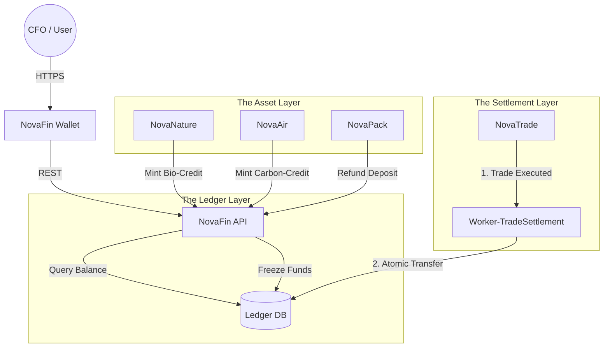

# 🏦 NovaFin

> **The Operating System for Circular Finance.**
> Digital ledger for multi-asset payments, ESG tokenization, staking mechanisms, and automated settlement.

[](https://www.google.com/search?q=https://github.com/novaeco-tech/novafin/actions)
[](https://opensource.org/licenses/MIT)
[](https://www.google.com/search?q=https://finance.novaeco.tech)

**NovaFin** is the Horizontal Enabler responsible for the **Capital Layer**. While `NovaTrade` manages the *marketplace* (matching buyers and sellers), **NovaFin** manages the *ledger* (movement of value).

It acts as the **Central Bank** of the ecosystem. It abstracts the complexity of trading diverse assets—Euros, Carbon Tons, Biodiversity Credits, and Deposit Tokens—into a unified, programmable interface compliant with the **EU Sustainable Finance Disclosure Regulation (SFDR)**.

-----

## 🎯 Value Proposition

The circular economy requires new types of financial instruments that traditional banks do not support. **NovaFin** fills this gap:

1.  **Multi-Asset Settlement:** Seamlessly settling a transaction where a company pays 70% in Euros and 30% in Carbon Credits.
2.  **Programmatic Escrow:** Holding funds for "Deposit Return Schemes" (`NovaPack`) or "Performance-Based Contracts" (`NovaChem`) and releasing them only when IoT data proves the outcome.
3.  **Incentive Staking:** Allowing actors to stake tokens to prove "Skin in the Game" (e.g., a recycler staking funds to guarantee they won't illegal dump waste).

-----

## 🏗️ Architecture (The Ledger Core)

NovaFin is a double-entry bookkeeping engine wrapped in an API. It relies on the [novafin-worker-trade-settlement](https://www.google.com/search?q=https://settle.finance.novaeco.tech) for high-volume batch processing.



### Integrated Services

  * **[NovaTrade](https://www.google.com/search?q=https://trade.novaeco.tech):** The trigger. When a trade occurs, NovaTrade sends a "Settlement Request" to NovaFin. NovaFin executes the payment.
  * **[Worker-TradeSettlement](https://www.google.com/search?q=https://settle.finance.novaeco.tech):** The processor. A dedicated worker that batches thousands of micro-transactions (e.g., bottle returns) into efficient ledger commits.
  * **[NovaPack](https://www.google.com/search?q=https://packaging.novaeco.tech):** The depositor. Tells NovaFin to "Lock €0.25" when a bottle is sold and "Unlock €0.25" when it is returned.
  * **[NovaNature](https://www.google.com/search?q=https://nature.novaeco.tech):** The minter. When a forest is verified, NovaNature tells NovaFin to issue 100 "Biodiversity Tokens" to the landowner's wallet.

-----

## ✨ Key Features

### 1\. The Unified Wallet

A single dashboard for all circular assets.

  * **Balances:** Shows EUR, USD, CO2 Tons, and Water Credits side-by-side.
  * **History:** Immutable audit trail of every transfer, linked to the `NovaMaterial` Passport ID that generated the value.

### 2\. Smart Escrow (Conditional Payments)

Replaces lawyers with code.

  * **Chemical Leasing:** `NovaChem` reports "1000 parts cleaned." NovaFin automatically releases payment from the Factory to the Solvent Supplier.
  * **Dispute Resolution:** If `NovaQuality` flags a shipment as "Contaminated," NovaFin automatically freezes the payment and refunds the buyer.

### 3\. Green Bond Tokenization

Financing the transition.

  * Allows cities to issue "Green Micro-Bonds" to fund `NovaInfra` upgrades (e.g., new recycling centers).
  * Investors (citizens) buy bonds directly via the wallet and receive interest payouts from the facility's recycling revenue.

### 4\. Carbon & Nature Markets

The backend for environmental credits.

  * **Minting:** Converting scientific data (from `NovaBalance` or `NovaAir`) into tradeable financial assets.
  * **Retirement:** "Burning" a credit when a company uses it to offset their footprint, ensuring it cannot be sold twice (Double Counting Prevention).

-----

## 🚀 Getting Started

We use **DevContainers** to provide a consistent development environment.

### Prerequisites

  * Docker Desktop
  * VS Code (with Remote Containers extension)
  * PostgreSQL (Local container provided)

### Installation

1.  **Clone the repo:**
    ```bash
    git clone https://github.com/novaeco-tech/novafin.git
    cd novafin
    ```
2.  **Open in VS Code:**
      * Run `code .`
      * Click **"Reopen in Container"** when prompted.
3.  **Start the Enabler:**
    ```bash
    make dev
    ```
      * **Wallet UI:** http://localhost:3000
      * **Ledger API:** http://localhost:8000/docs

### Configuration (`.env`)

```ini
# Ledger Settings
BASE_CURRENCY=EUR
ALLOW_NEGATIVE_BALANCE=false

# External Gateways
STRIPE_API_KEY=sk_test_...
BANK_API_ENDPOINT=https://openbanking.api/

# Integrations
NOVATRADE_URL=http://novatrade-api:8000
```

-----

## 📂 Repository Structure

This is a Monorepo containing the enabler's specific logic.

```text
novafin/
├── api/                # Python/FastAPI (Domain Logic)
│   ├── src/
│   │   ├── ledger/     # Double-entry accounting logic
│   │   ├── tokens/     # ERC-20 style token logic (Database backed)
│   │   └── escrow/     # Smart contract conditions
├── app/                # React/Next.js Frontend (Wallet UI)
│   ├── src/
│   │   ├── portfolio/  # Asset charts
│   │   └── transfer/   # Payment forms
├── website/            # Documentation (Docusaurus)
└── tests/              # Integration tests
```

-----

## 🧪 Testing

We use **Financial Integrity Testing**.

  * **Accounting Test:** `make test-ledger`
      * Simulates 1,000 random transfers between A, B, and C. Asserts that `Sum(Balances)` is constant (Zero-Sum Verification).
  * **Race Condition Test:** `make test-concurrency`
      * Attempts to spend the same €100 from two different threads simultaneously. Asserts that only one transaction succeeds.

-----

## 🤝 Contributing

**Security Warning:** This repository handles value. Code reviews are strict. All math must use `Decimal` types (never `float`) to prevent rounding errors.
See [CONTRIBUTING.md](https://www.google.com/search?q=../.github/CONTRIBUTING.md) for details.

**Maintainers:** `@novaeco-tech/maintainers-enabler-novafin`